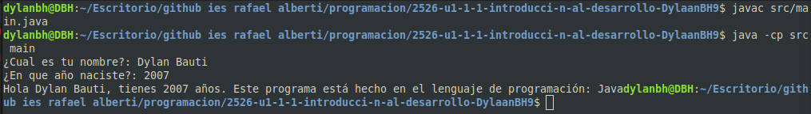

[](https://classroom.github.com/a/F4zkDqTW)
[](https://classroom.github.com/online_ide?assignment_repo_id=21017273&assignment_repo_type=AssignmentRepo)
# Práctica 2: Introducción al desarrollo. Ponlo en práctica.

Apoyate en los siguientes recursos para realizar la práctica:

[Descripción de la práctica](https://revilofe.github.io/section3/u01/practica/EDES-U1.-Practica011/)


---

# Título de la Actividad

## Identificación de la Actividad
- ID de la Actividad: P1.2 - Ponlo en practica - Evaluable
- Módulo: EDES
- Unidad de Trabajo:  U1: Introducción al desarrollo de software 
- Fecha de Creación: 15/10/25
- Fecha de Entrega: 16/10/25
- Alumno(s): 
  - Nombre y Apellidos: Dylan Bauti Huelva
  - Correo electrónico: dbauhue1708@g.educaand.es
  - Iniciales del Alumno/Grupo: DBH

## Descripción de la Actividad
El objetivo de esta práctica es entender las diferencias entre tres tipos de lenguajes de programación: interpretados (Python), compilados (C) y de máquina virtual (Java). Para cumplirla hice un programa sencillo en cada lenguaje que solicita el nombre y año de nacimiento del usuario para calcular su edad y mostrar un saludo. A través de este ejercicio, se analizan los distintos procesos de ejecución, la relación con el hardware y las herramientas utilizadas en el desarrollo.

## Instrucciones de Compilación y Ejecución
### 1. Requisitos Previos:
   - Python: Python 3.12.3
   - C: Compilador GCC 
   - Java: JDK 21
   - SO: Linux Mint
   - Editor: Geany

### 2. Pasos para Compilar y Ejecutar el Código:
   
#### Python
   ```bash
   # Ejecutar directamente con el intérprete
   python3 src/main.py
   ```

#### C
   ```bash
   # Compilar para crear un archivo ejecutable
   gcc src/main.c -o ejecutable_c

   # Ejecutar el programa
   ./ejecutable_c
   ```

#### Java
   ```bash
   # Compilar el código fuente a bytecode
   javac src/Main.java

   # Ejecutar el bytecode con la JVM
   java -cp src Main
   ```

## Desarrollo de la Actividad
### 5. Preguntas y Actividades para Evaluar Cada Criterio de Evaluación

#### 5.1. Criterio de Evaluación 1.a: Relación entre Software y Hardware

1.   Python (Interpretado):
   -  Memoria RAM: El intérprete de Python gestiona la memoria de forma automática. Cuando el usuario introducía su nombre y año.
   -  Procesador: La CPU no ejecutó mi código Python directamente. Lo que hizo fue ejecutar las instrucciones del programa intérprete de Python. Este lee el código fuente línea por línea y lo traducía a comandos que el procesador pudiera entender en tiempo real.
   -  Periféricos: El programa interactuó con el teclado para recibir el nombre y el año de nacimiento del usuario (input()) y con la pantalla para mostrar el resultado final (print()).

2.   C (Compilado):
   -  Memoria RAM: La gestión fue más manual. Al declarar variables como int edad; o char nombre[50];, se reservó un espacio fijo en la memoria. 
   -  Procesador: El procesador ejecutó directamente el código máquina resultante de la compilación. A diferencia de Python, no hubo una capa intermedia. El compilador tradujo mi código C a instrucciones nativas que la CPU ejecutó a máxima velocidad.
   -  Periféricos: Se usaron las funciones de la librería estándar scanf() y printf() para interactuar con el teclado y la pantalla. Estas funciones se comunican con el sistema operativo para leer desde el búfer del teclado y escribir en la consola.

3.   Java (Máquina Virtual):
   -  Memoria RAM: La JVM se encargó de toda la gestión de memoria. Ademas la JVM cuenta con un "Recolector de Basura" (Garbage Collector) que libera automáticamente la memoria que ya no se necesita.
   -  Procesador: De forma similar a Python, el procesador no ejecutó mi código Java directamente. Ejecutó las instrucciones de la JVM. La JVM, a su vez, interpretó el bytecode de mi programa y lo tradujo a código máquina usando JIT compilation para que la CPU lo ejecutara.
   -  Periféricos: Se utilizó la clase Scanner para leer la entrada del teclado y System.out.println() para imprimir en la pantalla.

#### 5.2. Criterio de Evaluación 1.c: Diferenciación entre Código Fuente, Código Objeto y Ejecutable

1.  Lenguajes Compilados (C):
  - El código fuente main.c se transformó usando el compilador GCC. Al usar el comando gcc src/main.c -o ejecutable_c, el compilador tradujo el código fuente a código máquina y el enlazador lo unió a las librerías estándar para generar un único archivo ejecutable llamado ejecutable_c.

2.  Lenguajes Interpretados (Python):
  - El código fuente main.py se ejecutó directamente con el intérprete, usando el comando python3 main.py. No se generó ningún archivo de código objeto o ejecutable visible; el intérprete procesó el código en tiempo real.

3.  Lenguajes con Máquina Virtual (Java):
  - El código fuente main.java se transformó a un código intermedio llamado bytecode. El comando javac main.java generó el archivo main.class en la carpeta src. Este archivo no es ejecutable por sí mismo, sino que fue interpretado por la JVM con el comando java -cp src Main.

#### 5.3. Criterio de Evaluación 1.d: Generación de Código Intermedio para Máquinas Virtuales

1.  Proceso de generación de bytecode (Java):
    El proceso comienza con el archivo de código fuente main.java. Al usar el compilador de Java (javac), este analiza el código, verifica la sintaxis y lo traduce al bytecode. Este bytecode se guarda en un archivo .class (main.class). El bytecode no está diseñado para una hardware concreto, sino para ser entendido por la JVM.

2.  Rol de la Máquina Virtual (Java):
    La JVM actúa como una capa de abstracción entre el código y el hardware.
   -    Portabilidad: Permite que el mismo archivo .class se ejecute en cualquier sistema operativo (Windows, macOS, Linux) que tenga una JVM instalada. Esto resuelve el problema de los lenguajes compilados como C, cuyo ejecutable solo funciona en el sistema para el que fue compilado.
   -    Ejecución: La JVM lee el bytecode y lo traduce a código máquina nativo del sistema operativo. Esto es diferente de la ejecución directa de C (que ya es código máquina) y de la interpretación pura de Python (que traduce línea a línea desde el fuente).

#### 5.4. Criterio de Evaluación 1.e: Clasificación de Lenguajes de Programación

1.  Clasificación de los tres lenguajes:

- Python: Interpretado, muy alto nivel, multiparadigma (imperativo, orientada a objetos, funcional)
- C: Compilado, bajo/medio nivel, imperativo/procedural
- Java: Híbrido (bytecode + interpretación), alto nivel, orientado a objetos

2.  Razones de la clasificación:

- Python: Es un lenguaje interpretado que ejecuta el código fuente al momento. Su alto nivel de abstracción simplifica el desarrollo al gestionar la memoria automáticamente.
- C: Es un lenguaje compilado que se traduce a código máquina nativo para un rendimiento máximo. Permite un control manual de la memoria a bajo nivel.
- Java: Es un sistema híbrido: el código se compila a bytecode y se ejecuta en una Máquina Virtual (JVM), garantizando su portabilidad entre sistemas.


#### 5.5. Criterio de Evaluación 1.f: Evaluación de Herramientas Utilizadas en el Desarrollo

1. Python:
   -    Sistema operativo: Linux Mint
   -    Editor de texto o IDE: Geany
   -    Intérprete: Se utilizó el intérprete de Python 3.12.3, que ejecutó el código directamente desde el archivo .py.
   -    Depurador: No utilice.
   -    Sistema de gestión de versiones: Git y GitHub.
   -    Otras herramientas: La terminal para ejecutar el programa.

2. C:
   -    Sistema operativo: Linux Mint
   -    Editor de texto o IDE: Geany
   -    Compilador: Se utilizó el compilador GCC para transformar el código fuente .c en un archivo ejecutable.
   -    Depurador: No utilice.
   -    Sistema de gestión de versiones: Git y GitHub.
   -    Otras herramientas: La terminal para compilar (gcc) y ejecutar el programa.

3. Java:
       Sistema operativo: Linux Mint
       Editor de texto o IDE: Geany
       Compilador/Intérprete: Se utilizó el JDK , que incluye el compilador javac para generar el bytecode y la JVM para ejecutarlo.
       Depurador: No utilice.
       Sistema de gestión de versiones: Git y GitHub.
       Otras herramientas: La terminal para usar los comandos javac y java.

### Código Fuente
- [Código Fuente Python](./src/main.py)
- [Código Fuente C](./src/main.c)
- [Código Fuente Java](./src/main.java)


### Ejemplos de Ejecución

1. Ejecución en Python:
 - Entrada 1: ¿Cual es tu nombre?: **Dylan**
 - Entrada 2: ¿En que año naciste?: **2007**
 - Salida: Hola Dylan, tienes 18 años. Este programa está hecho en el lenguaje de programación: Python


2. Ejecución en C:
 - Entrada 1: ¿Cual es tu nombre?: **Dylan**
 - Entrada 2: ¿En que año naciste?: **2007**
 - Salida: Hola Dylan, tienes 18 años. Este programa está hecho en el lenguaje de programación: C


3. Ejecución en Java:
 - Entrada 1: ¿Cual es tu nombre?: **Dylan**
 - Entrada 2: ¿En que año naciste?: **2007**
 - Hola Dylan, tienes 18 años. Este programa está hecho en el lenguaje de programación: Java


### Resultados de Pruebas
La funcionalidad del código se ha verificado mediante unas pruebas manuales para cada uno de los tres programas (Python, C y Java).
El método de prueba consistió en ejecutar cada programa y proporcionar datos de entrada predefinidos para comprobar si la salida coincidía con el resultado esperado.
Este uno de los casos de prueba y este devuelve correctamente lo que tiene que devolver:

#### Caso de Prueba 1: Datos Típicos

-   **Descripción:** Probar con un nombre y un año de nacimiento estándar.
-   **Entrada:**
    -   Nombre: `Dylan`
    -   Año de nacimiento: `2007`
-   **Salida Esperada (para los tres lenguajes):**
    ```
    Hola Dylan, tienes 18 años. Este programa está hecho en el lenguaje de programación: [Python/C/Java]
    ```
## Documentación Adicional
- Manual de Usuario: No hay.
- Autorización de Permisos: Se ha verificado que el profesorado tiene permisos de lectura en el repositorio para la correcta evaluación de la práctica.

## Conclusiones
Esta práctica permite ver las diferencias entre los paradigmas de compilación e interpretación. El desarrollo en C aunque más rápido en ejecución requiere una compilación explícita pero acosta de la portabilidad. Python permite rapidez de desarrollo gracias a su interpretación directa. Y Java se sitúa en un punto intermedio, ofreciendo la portabilidad gracias a la JVM, a costa de un proceso de dos pasos compilación a bytecode y ejecución.

## Referencias y Fuentes
w3schools.com
revilofe.github.io/section3/
